# Sistema de Gestión de Horarios
El Sistema de Gestión de Horarios permite administrar las clases que darán los docentes en el Tecnológico Nacional de México en León. Este sistema cuenta con tres roles diferentes: 
 *Administrador: Crear carreras, asignar jefes y profesores por carrera.
 *Jefe de carrera:  Listar, añadir, cargar, borrar y editar Materias; ver la sabana y reportes de materias por maestro de la carrera a su cargo.
 *Docente: Ver SU reporte de materias.
 
El proyecto fue realizado utilizando el patrón MVC (Modelo - Vista - Controlador).

## Índice de Contenido
* [Demo](#demo)
    * [Inicio de sesión](#inicio-de-sesión)
    * [Perfil](#perfil)
    * [Administador](#administrador)
        * [Módulo de Carreras](#módulo-de-carreras)
        * [Módulo de Docentes](#módulo-de-docentes)
        * [Módulo de Jefes Carrera](#módulo-de-jefes)
    * [Jefe de Carrera](#jefe-de-carrera)
        * [Módulo de Materias](#módulo-de-materias)
        * [Módulo de Sábana de Materias](#módulo-de-sábana-de-materias)
        * [Módulo de Reportes de Docentes](#módulo-de-reportes)
    * [Docente](#docente)
        * [Módulo de su Reporte](#módulo-de-reporte-docente)
* [Prerequisitos](#prerequisitos)
* [Cómo clonar el proyecto](#cómo-clonar-el-proyecto)
* [Instalación](#instalación-)
* [Cómo correr con Docker](#cómo-correr-con-docker)
* [Credenciales de usuarios](#credenciales-de-usuarios)
* [Vista Previa](#vista-previa)
* [Notas](#notas)

## Demo 
### Inicio de sesión
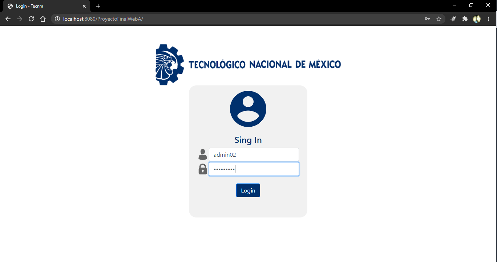
### Perfil
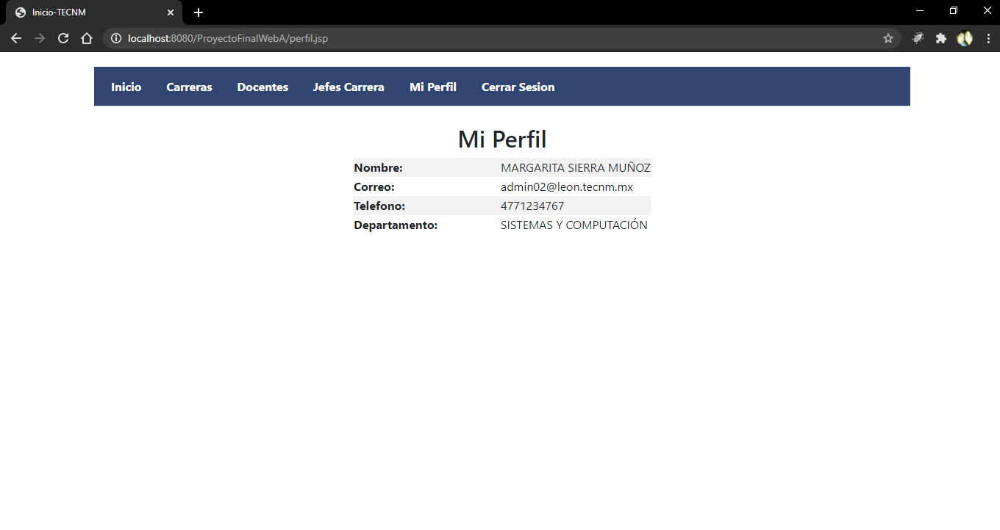
### Administrador
#### Módulo de Carreras
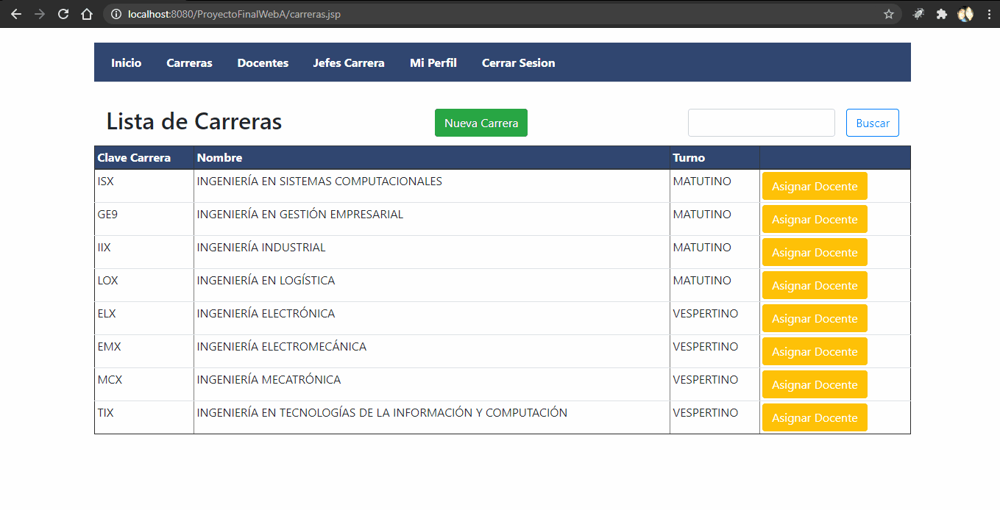
#### Módulo de Docentes
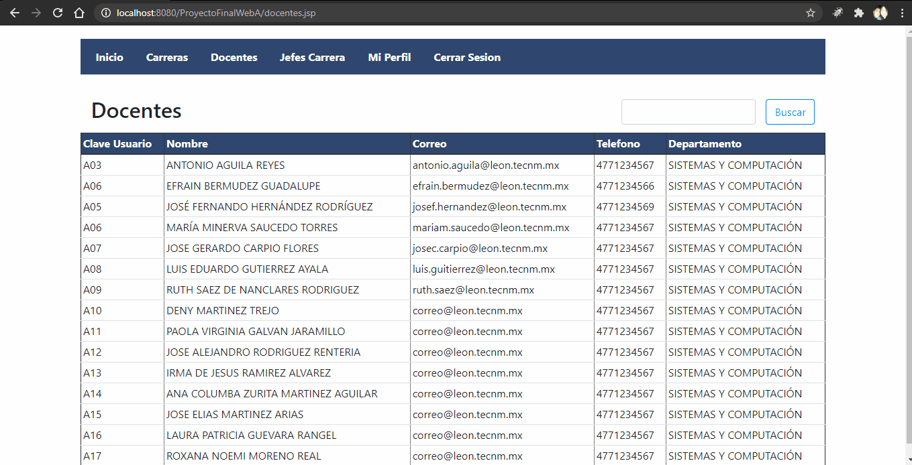
#### Módulo de Jefes
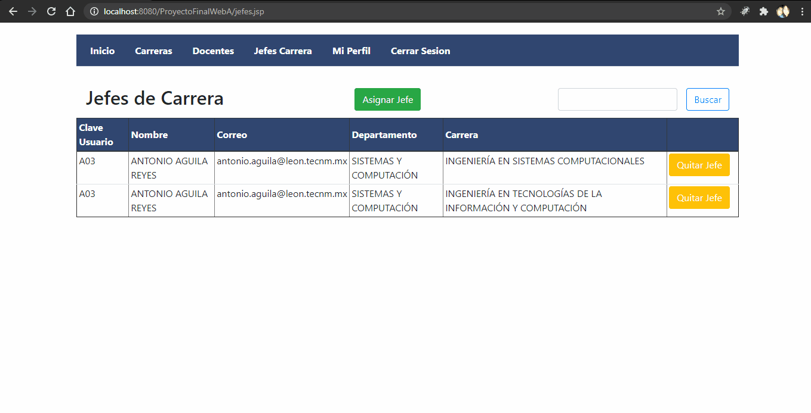
### Jefe de Carrera
#### Módulo de Materias
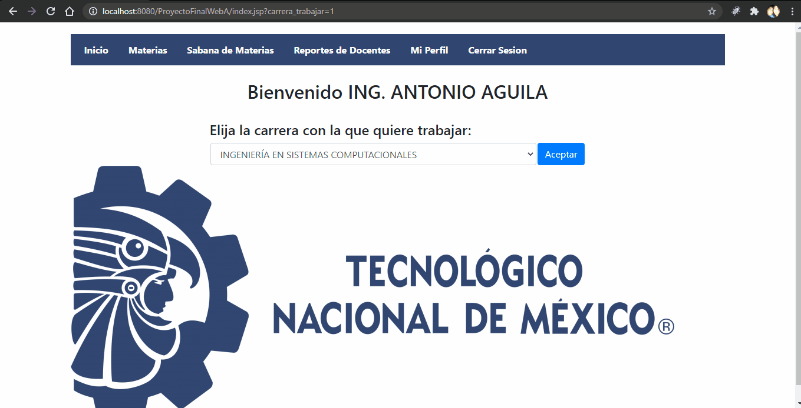
#### Módulo de Sábana de Materias
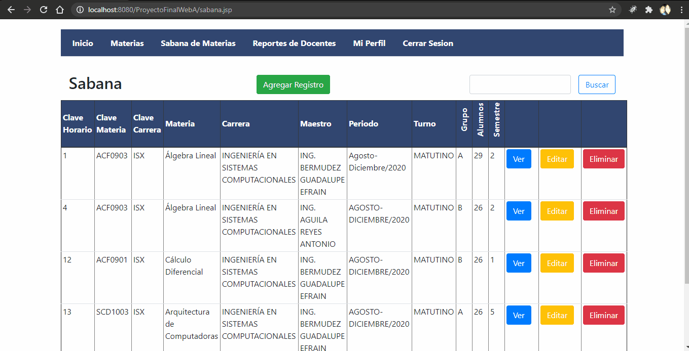
#### Módulo de Reportes
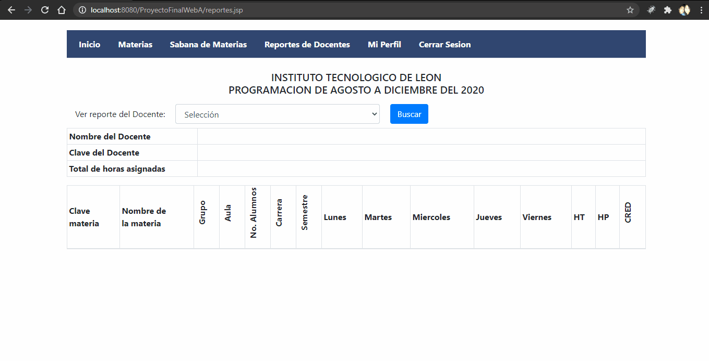
### Docente
#### Módulo de su Reporte
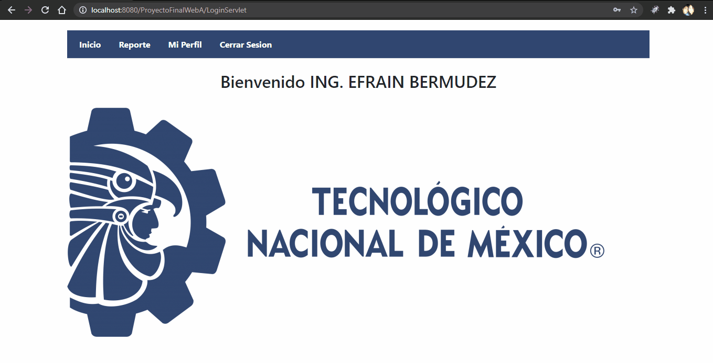
## Prerequisitos
* Para crear este proyecto se utilizó el [IDE Eclipse para Desarrolladores Java Enterprise en su versión 2020-06 (4.16.0)](https://www.eclipse.org/downloads/packages/release/2020-06/r/eclipse-ide-enterprise-java-developers).
* Se utiliza como servidor web [Apache Tomcat 9.0](https://tomcat.apache.org/download-90.cgi).
* Se utiliza [XAMPP](https://www.apachefriends.org/es/download.html) para levantar el servidor MySQL [proyecto_mvc](database/proyecto_mvc.sql).
* Si quieres correr este proyecto con Docker y evitar descargar manualmente todo lo que se mencionó anteriormente, se necesita instalar [Docker](https://www.docker.com/products/docker-desktop) en la versión de tu preferencia y seguir los pasos en la sección de [Cómo correr con Docker](#cómo-correr-con-docker).

## Cómo clonar el proyecto
1. Abre la terminal que utilizas para clonar proyectos de git en la carpeta donde deseas que se guarde el proyecto.
2. Pega el siguiente comando:
    ```bash
    git clone https://github.com/MaggieSierra/ProyectoFinalWebA.git
    ```

## Instalación
1. Abre el proyecto clonado en un IDE.
3. Tener [Apache Tomcat](#prerequisitos) como servidor web dentro del IDE.
4. Tener levantado el servidor MySQL desde [XAMPP](#prerequisitos).
5. Dar clic derecho al nombre del proyecto en el IDE, clic en **Run as** y eliges la opción **Run on server**.

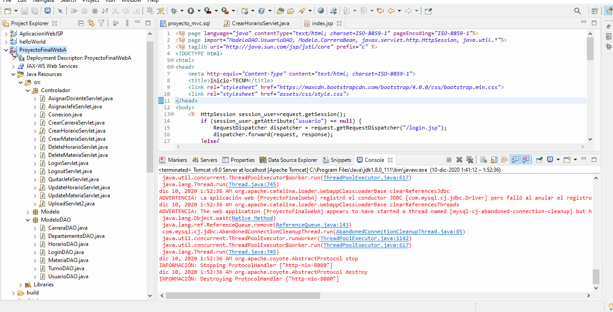

## Cómo correr con Docker
Para correr el proyecto con Docker: 
1. Ejecuta el archivo [docker-compose.yml](docker-compose.yml) para levantar los contenedores.
2. Despues de que ver los dos contenedores de Apache Tomcat y MySQL corriendo dirígete a la URL de la aplicación:
    ```
    http://localhost:8080/ProyectoFinalWebA/
    ```

## Credenciales de Usuarios
Administrador:
```
usuario: admin02
contraseña: admin1234
```

Jefe de carrera:
```
usuario: aaguila01
contraseña: 123
```

Docente:
```
usuario: ebermudez12
contraseña: 123
```

## Vista Previa
Así se deberá ver la página principal del proyecto correctamente instalado.

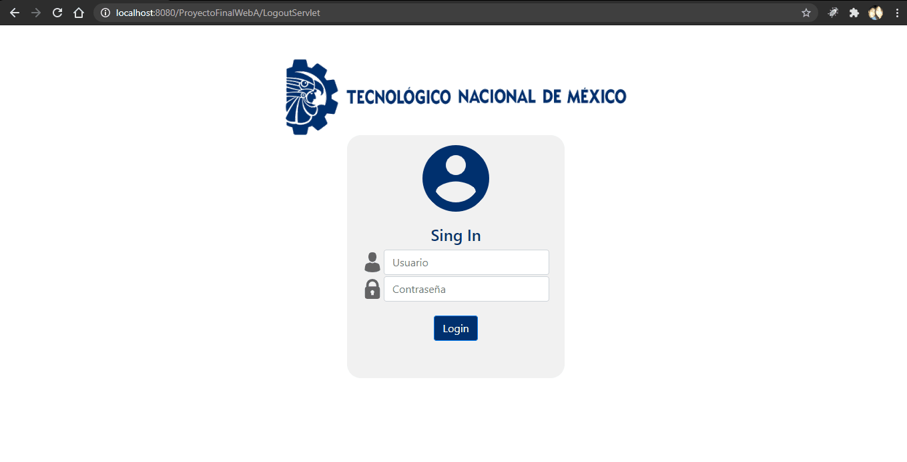

### Notas
* La carpeta de [src/Modelo](/src/Modelo) y [src/ModeloDAO](/src/ModeloDAO) actúan como la parte de Modelos del patrón MVC.
* La carpeta de [WebContent](/WebContent) actúa como la parte de Vistas del patrón de diseño MVC.
* La carpeta de [src/Controlador](/src/Controlador) actúa como la parte de Controladores del patrón MVC.

Este sistema web fue realizado como proyecto final de la materia de Programación Web Avanzada impartida por el Ing. Carlos Rafael Levy Rojas.

---
Elaborado por Margarita Del Carmen Sierra Muñoz